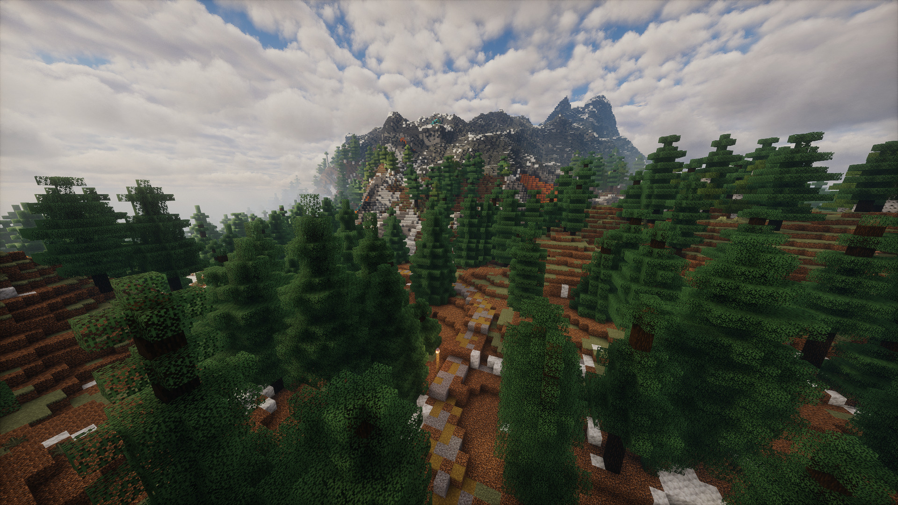
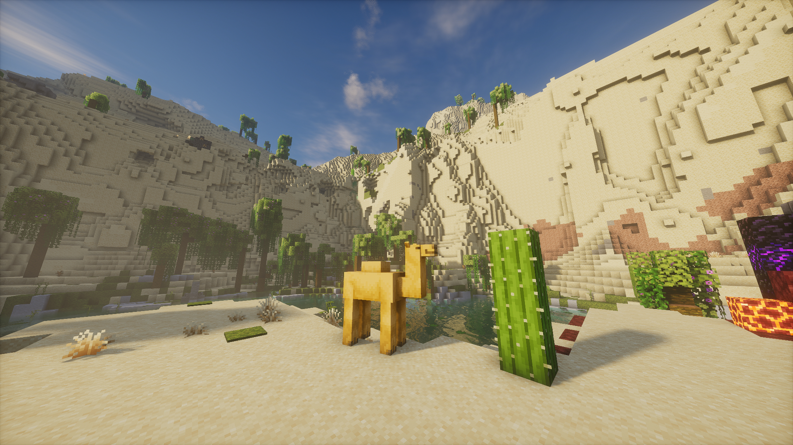

# Roads Less Travelled

A Minecraft 1.21.1 modpack featuring Oritech, Affinity, and Origins

**Roads Less Travelled** features a few core mods, with additional mods emphasizing pillars of Quality of Life, Exploration, and Self-expression. Explore the beautifully generated world, conquer obstacles with a host of new equipment, build and express yourself with more blocks and cosmetic options, and revel in an enhanced Minecraft experience.

# Installation

- On GitHub, click the green "Code" dropdown, and then click "Download ZIP".

- Extract the ZIP, and open the .mrpack inside with your modloader. I recommend Prism.

# Mods

### Oritech

Mechanize. Make efficient. Build a particle accelerator. This is a mod that follows closely in the footsteps of Industrial Craft, but does it in a simpler and more flavorful way. The Oracle mod is also included, providing an ingame wiki.

This modpack alters the generation of aboveground node boulders slightly, so common ones are made of stone, rare ones do not generate diamonds, and all of them generate less ore overall. They retain their intended functionality of marking underground resource nodes.

### Affinity

Utilize the magical forces of nature to create powerful tools such as Artifact Blades and numerous staves. This magitech mod leaves much to be discovered.

### Origins Minus

Choose from 10 thematic Origins, each with unique and powerful abilities of their own.

### Farmer's Delight

The food mod of all time.

### Quality of Life Mods

**Accessorify** - several vanilla items have become accessories. Spyglasses can be equipped and assigned to a hotkey!

**ActuallyHarvest** - right click to harvest anything!

**EasyAnvils** - reworked anvil costs and free renaming (try right clicking while holding a nametag)

**EasyMagic** - reroll enchantments for a tiny cost

**Easy Shulker Boxes** - shulker boxes act like bundles inside the inventory

**Grind Enchantments** - grindstones get more functionality, including transferring enchantments to books!

**Lootr** - instanced loot

**MagicMirror** - the Magic Mirror from that one game

**MoreLeads** - more things can be lead

**Ping Wheel** - multiplayer pinging

**Reinforced Chests/Barrels** - adds higher capacity storage. Make sure to craft a wood-variant chest into a normal chest for use with these recipes.

**Tax Free Levels** - enchantment costs are nowhere near as egregious!

**Tree Harvester** - by default, shift-harvest with an axe to cut down entire trees and replant the sapling in one fell swoop

### Exploration Mods

**Cottages Witch Huts** - cottages and witch huts

**Dungeons and Taverns** - all in the name

**Explorations** - vanilla style structures

**Incendium** - nether biome and structure overhaul

**Landmarks** - small natural additions

**Luki's mods** - structures, structures, massive structures

**RoadWeaver** - generates roads between villages! will incur additional worldgen load

**Structures** - more structures

**Sunken Spires** - ocean additions

**Terralith** - the central biome adding mod; no new blocks, just amazing views

**Trek** - moar structures!

### Self-expression Mods

**Another Furniture** - vanilla-fitting furnishings

**Artifacts** - find unique and powerful artifacts to equip

**Elytra Trims** - ability to apply trims to elytra

**Enchants Plus** - more enchantments

**Gauntlets** - new weapon type that gives armor

**Immersive Armors** - cool new armors with unique effects

**More Armor Trims** - new armor trims

**Storage Delight** - new vanilla-fitting storage blocks

**Tool Trims** - adds new trims specifically for vanilla tools

**Traveler's Backpacks** - highly customizable, expandable backpacks with unique equip effects!

**Trims - Color Splash!** - more trim materials

**Weapons Expanded** - adds a load of new weapon types

**Wind-Charged Weaponry** - adds a few unique weapons

### Other Cool Things

**Additional Additions** - Rose Gold tools which go between Iron and Diamond, plus many more vanilla...additions

**Ambient Sounds + Presence Footsteps + Sound Physics Remastered + Sounds** - completely changes the audio experience of Minecraft

**Copper Age Backport + VanillaBackport** - backports features from future versions

**Fishing Expansion** - a new progression path for fishing!

**Friends&Foes** - adds the mobs rejected in past mob votes

**Living Things** - adds new animals and creatures to the world

**Raccoons & Rabies** - adds raccoons...

**Toffy's Hooks** - grappling hooks and other hook things

### Optional Mods

**Distant Horizons** - doesn't look great when combined with Terralith worldgen and shaders, and adds to already bloated world save size.

**Xaero's World Map and Minimap + Waystones compat** - may detract from the exploration experience; also overlaps with Accesorize features. (I still play with it, though)

# KNOWN BUGS

- Viewing tool recipes shows all the glint recipes, often before the actual tool. This is a bug with Additional Additions that has not been ironed out. The workaround is to use JEI instead of REI, but that lacks compatibility with the chosen tech mods, to my knowledge. So I'm willing to make this small sacrifice to convenience.

- Roadweaver roads cut through trees. This is just how it works; you can choose to remove Roadweaver if you wish, as it adds a lot of initial wordgen time.
